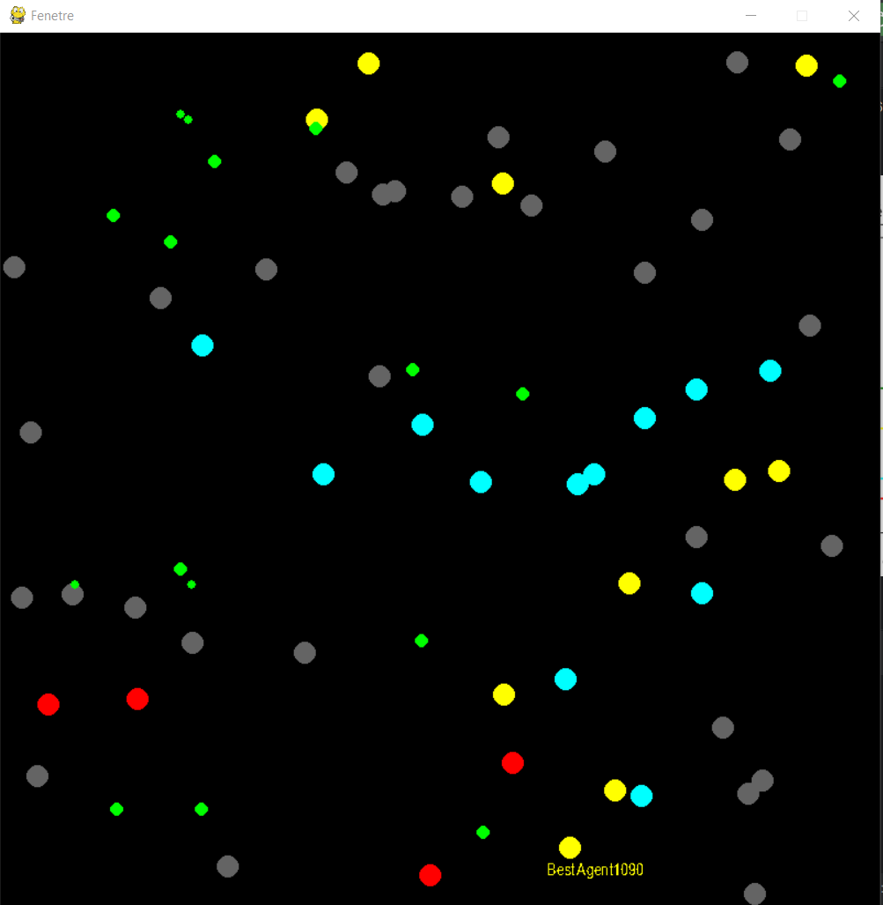
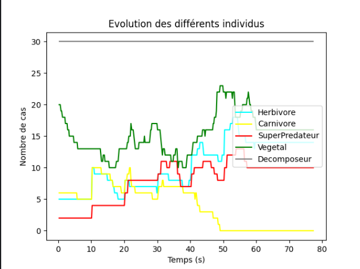

# 🍃🌿 VIVARIUM 🌿🍃  
### AUBERT Baptiste

Ce projet est une mise en oeuvre d'un vivarium contenant différents types d'agents (superprédateur, carnivore, décomposeur, herbivore) et d'éléments (végétaux) en utilisant l'architecture SMA.

## Architecture SMA
Chaque élément du vivarium est représenté par une classe distincte, chacune d'elles étant un agent pro-actif doté d'un corps et d'un champ de vision (fustrum).

### Body
Pour chaque body il y a:

 - Une date de naissance
 - Une espérance de vie
 - Il y a une vitesse

D'autre paramètres sont définis dans les classes filles aléatoirement en fonction du scenario. :
 - Une vitesse max
 - Une accélération max
 - Une jauge de faim
 - Une jauge de fatigue
 - Une jauge de reproduction

## Agents
-  Super Predateur 🐺
-  Carnivore 🐍
-  Herbivore 🐀
-  Decomposeur 🐛

## Items
-  Vegetal 🍃 Les végétaux sont des éléments qui peuvent être mangés par les herbivores. Ils grandissent au fil du temps et leur taille augmente en fonction de leur âge.


## Mise à jour des body
Une méthode update() est disponible pour chaque corps afin de faire évoluer les propriétés mentionnées ci-dessus en fonction du temps. Cette méthode prend en compte les événements suivants:

 - Mort de l'agent lorsque le corps est trop vieux
 - Sommeil de l'agent lorsque la jauge de fatigue est pleine
 - Mort de l'agent de faim lorsque la jauge de faim est pleine
 - Reproduction de l'agent lorsque la jauge de reproduction est pleine

## Comportements
Les agents ont différents comportements:
 - « Mangeur » : l’agent chasse
 - « Survie » : l’agent fuit un prédateur
 - « Symbiose » : l’agent utilise un autre agent pour se protéger
```python
    def update(self):
        self.proies, self.predateurs, self.amis = self.filtrePerception()
        self.body.acceleration += (self.mangeur(self.proies) + self.survie(self.predateurs) + self.symbiose(self.amis))

    def mangeur(self, proies):
        target = Vector2()
        if proies:
            target = self.proies[0].position - self.body.position
        return target

    def survie(self, predateurs):
        target = Vector2()
        if predateurs:
            target = self.body.position - self.predateurs[0].position
        return target

    def symbiose(self, amis):
        target = Vector2()
        if amis:
            target = self.amis[0].position - self.body.position
        return target
```

## Visualisation du vivarium

 - Le **best agent** est l'individu ayant la meilleur génétique (plus grande vitesse max, plus grandes jauges, etc.) Son score est affiché à coté de lui

## Visualisation des statistiques

```
--------------------
L'agent avec la meilleur génétique est : Carnivore avec un score de : 1056
Pourcentage de SuperPredateur : 5%
Pourcentage de Carnivore : 14%
Pourcentage de Herbivore : 12%
Pourcentage de Decomposeur : 70%
--------------------
```
